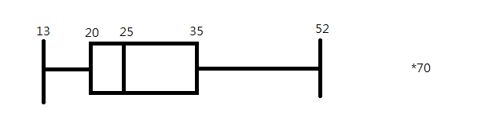
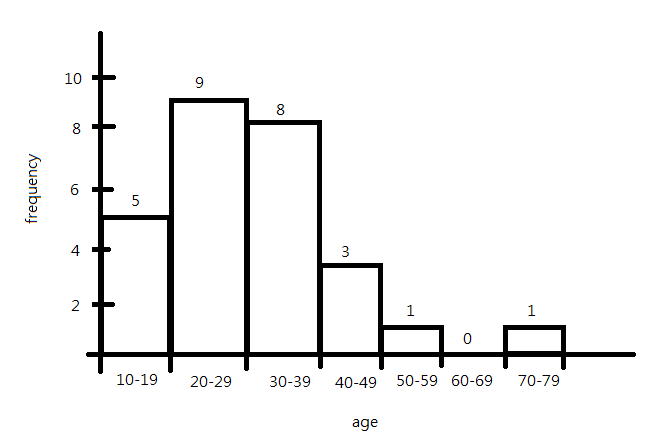

# 教育數據探勘與應用 hw1

## 資工三 111590012 林品緯

### 2.2

#### (e)

| name         | value |
| ------------ | ----- |
| 最小值       | 13    |
| 第一四分位數 | 20    |
| 中位數       | 25    |
| 第三四分位數 | 35    |
| 最大值       | 70    |

#### (f)

$IQR = 35-20=15$

$20-1.5\times15=-2.5$

$35+1.5\times15=57.5$

70 為離群值

### 2.11

|       | $A_1$ | $A_2$ |
| ----- | ----- | ----- |
| $x_1$ | 1.5   | 1.7   |
| $x_2$ | 2     | 1.9   |
| $x_3$ | 1.6   | 1.8   |
| $x_4$ | 1.2   | 1.5   |
| $x_5$ | 1.5   | 1.0   |

#### (a)

Euclidean distance:

$$
\begin{aligned}
d(x,x_1)&=\sqrt{(1.4-1.5)^2+(1.6-1.7)^2} \\
&= \sqrt{(-0.1)^2+(-0.1)^2} \\
&=\sqrt{0.02}
\end{aligned}
$$

$$
\begin{aligned}
d(x,x_2)&=\sqrt{(1.4-2)^2+(1.6-1.9)^2} \\
&= \sqrt{(-0.6)^2+(-0.3)^2} \\
&=\sqrt{0.45}
\end{aligned}
$$

$$
\begin{aligned}
d(x,x_3)&=\sqrt{(1.4-1.6)^2+(1.6-1.8)^2} \\
&= \sqrt{(-0.2)^2+(-0.2)^2} \\
&=\sqrt{0.08}
\end{aligned}
$$

$$
\begin{aligned}
d(x,x_4)&=\sqrt{(1.4-1.2)^2+(1.6-1.5)^2} \\
&= \sqrt{(0.2)^2+(0.1)^2} \\
&=\sqrt{0.05}
\end{aligned}
$$

$$
\begin{aligned}
d(x,x_5)&=\sqrt{(1.4-1.5)^2+(1.6-1.0)^2} \\
&= \sqrt{(-0.1)^2+(0.6)^2} \\
&=\sqrt{0.37}
\end{aligned}
$$

ranking: $x_1, x_4, x_3, x_5, x_2$

Manhattan distance:

$$
\begin{aligned}
d(x,x_1)&=|(1.4-1.5)|+|(1.6-1.7)| \\
&=0.1+0.1 \\
&=0.2
\end{aligned}
$$

$$
\begin{aligned}
d(x,x_2)&=|(1.4-2)|+|(1.6-1.9)| \\
&=0.6+0.3 \\
&=0.9
\end{aligned}
$$

$$
\begin{aligned}
d(x,x_3)&=|(1.4-1.6)|+|(1.6-1.8)| \\
&=0.2+0.2 \\
&=0.4
\end{aligned}
$$

$$
\begin{aligned}
d(x,x_4)&=|(1.4-1.2)|+|(1.6-1.5)| \\
&=0.2+0.1 \\
&=0.3
\end{aligned}
$$

$$
\begin{aligned}
d(x,x_5)&=|(1.4-1.5)|+|(1.6-1.0)| \\
&=0.1+0.6 \\
&=0.7
\end{aligned}
$$

ranking: $x_1, x_4, x_3, x_5, x_2$

supremum distance:

$$
\begin{aligned}
d(x,x_1)&=max(|(1.4-1.5)|, |(1.6-1.7)|) \\
&=max(0.1, 0.1) \\
&=0.1
\end{aligned}
$$

$$
\begin{aligned}
d(x,x_2)&=max(|(1.4-1.5)|, |(1.6-1.0)|) \\
&=max(0.6, 0.3) \\
&=0.6
\end{aligned}
$$

$$
\begin{aligned}
d(x,x_3)&=max(|(1.4-1.6)|, |(1.6-1.8)|) \\
&=max(0.2, 0.2) \\
&=0.2
\end{aligned}
$$

$$
\begin{aligned}
d(x,x_4)&=max(|(1.4-1.2)|, |(1.6-1.5)|) \\
&=max(0.2, 0.1) \\
&=0.2
\end{aligned}
$$

$$
\begin{aligned}
d(x,x_5)&=max(|(1.4-1.5)|, |(1.6-1.0)|) \\
&=max(0.1, 0.6) \\
&=0.6
\end{aligned}
$$

ranking: $x_1, x_3, x_4, x_2, x_5$

cosine similarity:

$$
\begin{aligned}
d(x,x_1)&=\frac{1.4\times1.5+1.6\times1.7}{||x||\cdot||x_1||} \\
&=\frac{2.1+2.72}{\sqrt{1.4^2+1.6^2}\times\sqrt{1.5^2+1.7^2}} \\
&=\frac{4.82}{\sqrt{4.52}\times\sqrt{5.14}} \\
&=0.999991391
\end{aligned}
$$

$$
\begin{aligned}
d(x,x_2)&=\frac{1.4\times2+1.6\times1.9}{||x||\cdot||x_2||} \\
&=\frac{2.8+3.04}{\sqrt{1.4^2+1.6^2}\times\sqrt{2^2+1.9^2}} \\
&=\frac{5.84}{\sqrt{4.52}\times\sqrt{7.61}} \\
&=0.995752261
\end{aligned}
$$

$$
\begin{aligned}
d(x,x_3)&=\frac{1.4\times1.6+1.6\times1.8}{||x||\cdot||x_3||} \\
&=\frac{2.24+2.88}{\sqrt{1.4^2+1.6^2}\times\sqrt{1.6^2+1.8^2}} \\
&=\frac{5.12}{\sqrt{4.52}\times\sqrt{5.8}} \\
&=0.999969484
\end{aligned}
$$

$$
\begin{aligned}
d(x,x_4)&=\frac{1.4\times1.2+1.6\times1.5}{||x||\cdot||x_4||} \\
&=\frac{1.68+2.4}{\sqrt{1.4^2+1.6^2}\times\sqrt{1.2^2+1.5^2}} \\
&=\frac{4.08}{\sqrt{4.52}\times\sqrt{3.69}} \\
&=0.999028235
\end{aligned}
$$

$$
\begin{aligned}
d(x,x_5)&=\frac{1.4\times1.5+1.6\times1.0}{||x||\cdot||x_5||} \\
&=\frac{2.1+1.6}{\sqrt{1.4^2+1.6^2}\times\sqrt{1.5+1.0^2}} \\
&=\frac{3.7}{\sqrt{4.52}\times\sqrt{3.25}} \\
&=0.965363393
\end{aligned}
$$

ranking: $x_1, x_3, x_4, x_2, x_5$

#### (b)

|        | $A_1'$                    | $A_2'$                    |
| ------ | ------------------------- | ------------------------- |
| $x_1'$ | $\frac{1.5}{\sqrt{5.14}}$ | $\frac{1.7}{\sqrt{5.14}}$ |
| $x_2'$ | $\frac{2}{\sqrt{7.61}}$   | $\frac{1.9}{\sqrt{7.61}}$ |
| $x_3'$ | $\frac{1.6}{\sqrt{6.8}}$  | $\frac{1.8}{\sqrt{6.8}}$  |
| $x_4'$ | $\frac{1.2}{\sqrt{3.69}}$ | $\frac{1.5}{\sqrt{3.69}}$ |
| $x_5'$ | $\frac{1.5}{\sqrt{3.25}}$ | $\frac{1.0}{\sqrt{3.25}}$ |
| $x'$   | $\frac{1.4}{\sqrt{4.52}}$ | $\frac{1.6}{\sqrt{4.52}}$ |

$$
\begin{aligned}
d(x',x_1')&=0.004149351
\end{aligned}
$$

$$
\begin{aligned}
d(x',x_2')&=0.092170915
\end{aligned}
$$

$$
\begin{aligned}
d(x',x_3')&=0.007812321
\end{aligned}
$$

$$
\begin{aligned}
d(x',x_4')&=0.044085487
\end{aligned}
$$

$$
\begin{aligned}
d(x',x_5')&=0.263198051
\end{aligned}
$$

ranking: $x_1, x_3, x_4, x_2, x_5$

### 2.14

#### (a)

| equal-frequency bins | means | smoothing by bin means |
| -------------------- | ----- | ---------------------- |
| 13, 15, 16           | 15    | 15, 15, 15             |
| 16, 19, 20           | 18    | 18, 18, 18             |
| 20, 21, 22           | 21    | 21, 21, 21             |
| 22, 25, 25           | 24    | 24, 24, 24             |
| 25, 25, 30           | 27    | 27, 27, 27             |
| 33, 33, 35           | 34    | 34, 34, 34             |
| 35, 35, 35           | 35    | 35, 35, 35             |
| 36, 40, 45           | 41    | 41, 41, 41             |
| 46, 52, 70           | 56    | 56, 56, 56             |

Effect: 使資料便平滑並減少資料中的雜訊，但會損失資料的精確度且可能會遺失離群值。

#### (b)

1. 求出資料中的 $Q_1$ 、 $Q_3$ ，並用 $Q_1$ 、 $Q_3$ 求出 $IQR$
2. 求出 $Q_1-1.5\times IQR$ 和 $Q_3+1.5\times IQR$
3. 低於 $Q_1-1.5\times IQR$ 和高於 $Q_3+1.5\times IQR$ 即為離群值

### 2.18

#### (a)

$$
\begin{aligned}
age'&=\frac{35-13}{70-13}\times(1.0-0.0)+0.0 \\
&=0.386
\end{aligned}
$$

#### (b)

$\mu=\frac{809}{27}$

$\sigma=12.70$

$$
\begin{aligned}
age' &= \frac{35-\frac{809}{27}}{12.70} \\
&=\frac{\frac{136}{27}}{12.70} \\
&=0.397
\end{aligned}
$$

### 2.19

#### (b)

$\overline{age}=\frac{836}{18}$

$\overline{fat}=\frac{518}{18}$

$$
\begin{aligned}
\sum^{n}_{i=1}(age_i-\overline{age})(fat_i-\overline{fat})=1700.333333
\end{aligned}
$$

$$
\begin{aligned}
\sqrt{\sum^{n}_{i=1}(age_i-\overline{age})^2}=54.50178386
\end{aligned}
$$

$$
\begin{aligned}
\sqrt{\sum^{n}_{i=1}(fat_i-\overline{fat})^2}=38.15684735
\end{aligned}
$$

$$
\begin{aligned}
r&=\frac{\sum^{n}_{i=1}(age_i-\overline{age})(fat_i-\overline{fat})}{\sqrt{\sum^{n}_{i=1}(age_i-\overline{age})^2}\sqrt{\sum^{n}_{i=1}(fat_i-\overline{fat})^2}} \\
&=\frac{1700.333333}{54.50178386\times38.15684735} \\
&=0.817618796
\end{aligned}
$$

age 和 fat 是為正相關關係。

### 2.22

#### (a)

| frequency | count |
| --------- | ----- |
| 10-19     | 5     |
| 20-29     | 9     |
| 30-39     | 8     |
| 40-49     | 3     |
| 50-59     | 1     |
| 60-69     | 0     |
| 70-79     | 1     |

