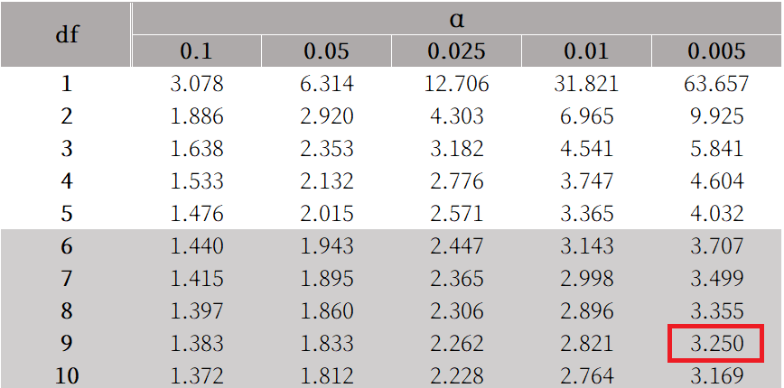

# 教育數據探勘與應用 hw3

## 資工三 111590012 林品緯

### 6.6

會叫做 naive 是因為假設特徵之間都是獨立的，用於簡化計算。

用已知條件的機率預測目標條件的機率。

### 6.8

|                      | 優點         | 缺點         |
| -------------------- | ------------ | ------------ |
| Eager classification | 預測時間快   | 訓練時間長   |
| Lazy classification  | 無須訓練模型 | 預測計算量大 |

### 6.9

求出預測資料和所有資料的個別距離，選擇 $k$ 個最近的資料，輸出 $k$ 個中最常見的類別作為預測類別。

```python
def euclidean_distance(x, X):
    # 計算歐幾里得距離
    n = len(x.attributes)
    s = 0
    for i in range(n):
        s+=(x.attributes[i]-X.attributes[i])**2

    return s**0.5

def KNN_classification(k, x, D):
    # 求出預測資料和所有資料的個別距離
    distance = []
    for d in D:
        dist = euclidean_distance(x,d)
        distance.append((dist,d.classname))

    # 排序
    distance.sort(key=lambda x:x[0])

    # 選擇 k 個最近的資料
    distance = distance[:k]

    # 統計類別
    d = dict()
    for dist,classname in distance:
        d[classname] = d.get(classname,0)+1

    # 找出最常見的類別
    maximum = 0
    maximum_classname = None
    for k,v in d.items():
        if v>maximum:
            maximum = v
            maximum_classname = k

    return maximum_classname
```

### 6.17

[參考影片](https://youtu.be/0awZbJTwgMM?si=_hSWEEnPycQFX9-c)

由上到下依序把 probability 當 thresholds，因為上方 probability 大於下方 probability，所以上方預測都為 P ，因此 TP 和 FP 不會改變，只要累加當前列的預測就好。

| Tuple# | Class | Probability | TP  | FP  | TN  | FN  | TPR | FPR |
| ------ | ----- | ----------- | --- | --- | --- | --- | --- | --- |
| 1      | P     | 0.95        | 1   | 0   | 5   | 4   | 0.2 | 0   |
| 2      | N     | 0.85        | 1   | 1   | 4   | 4   | 0.2 | 0.2 |
| 3      | P     | 0.78        | 2   | 1   | 4   | 3   | 0.4 | 0.2 |
| 4      | P     | 0.66        | 3   | 1   | 4   | 2   | 0.6 | 0.2 |
| 5      | N     | 0.60        | 3   | 2   | 3   | 2   | 0.6 | 0.4 |
| 6      | P     | 0.55        | 4   | 2   | 3   | 1   | 0.8 | 0.4 |
| 7      | N     | 0.53        | 4   | 3   | 2   | 1   | 0.8 | 0.6 |
| 8      | N     | 0.52        | 4   | 4   | 1   | 1   | 0.8 | 0.8 |
| 9      | N     | 0.51        | 4   | 5   | 0   | 1   | 0.8 | 1   |
| 10     | P     | 0.40        | 5   | 5   | 0   | 0   | 1   | 1   |


### 6.19

| M1   | M2   | d    |
| ---- | ---- | ---- |
| 30.5 | 22.4 | 8.1  |
| 32.2 | 14.5 | 17.7 |
| 20.7 | 22.4 | -1.7 |
| 20.6 | 19.6 | 1.0  |
| 31.0 | 20.7 | 10.3 |
| 41.0 | 20.4 | 10.6 |
| 27.7 | 22.1 | 5.6  |
| 26.0 | 19.4 | 6.6  |
| 21.5 | 16.2 | 5.3  |
| 26.0 | 35.0 | -9.0 |

$\overline{d}=6.45$

$s_d=8.7$

$$
\begin{aligned}
t &= \frac{\overline{d}}{s_d/\sqrt{n}} \\
&=\frac{6.45}{8.7/\sqrt{10}} \\
&=2.34
\end{aligned}
$$



根據查表後發現臨界值為 3.25，由於計算結果 2.34<3.25 ，所以 M1 和 M2 無明顯差異，因此無法確定哪一個模型明顯比另一個模型好。
